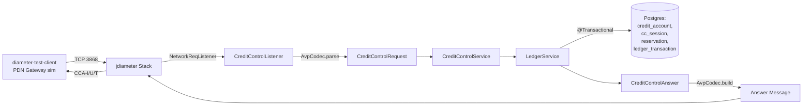

# diameter-cc

> **Diameter Credit-Control Server** — Spring Boot 3.5 / Java 21 implementation of the **Gy interface (RFC 4006, Application-Id 4)** on jdiameter 1.7.x. Real-time prepaid mobile billing with idempotent partial debits, Postgres credit ledger, bundled PDN-Gateway test client, Testcontainers integration suite, Prometheus + Grafana observability.

[](https://openjdk.org/)
[](https://spring.io/projects/spring-boot)
[](https://github.com/RestComm/jdiameter)
[](https://datatracker.ietf.org/doc/html/rfc4006)
[](https://www.postgresql.org/)
[](https://testcontainers.com/)
[](https://prometheus.io/)
[](https://grafana.com/)
[](LICENSE)
[]()

## What this is

`diameter-cc` implements the Diameter **Gy credit-control flow** end-to-end:

- Peer state machine (CER/CEA, DWR/DWA, DPR/DPA) on TCP :3868
- CCR-Initial / Update / Terminate handling (RFC 4006 §6)
- Idempotent partial debits keyed on `(Session-Id, CC-Request-Number)`
- Postgres-backed credit account ledger with immutable audit trail
- Bundled `diameter-test-client` simulating a PDN Gateway running a 5-minute prepaid call cycle
- Prometheus metrics + Grafana dashboard with CCR latency histograms and Result-Code breakdowns

## Why this pairs with [cdr-pipeline](https://github.com/soneeee22000/cdr-pipeline)

`cdr-pipeline` and `diameter-cc` are deliberately built as a pair — same business problem (mobile billing), opposite latency regimes.

| Aspect           | cdr-pipeline                | diameter-cc                           |
| ---------------- | --------------------------- | ------------------------------------- |
| Billing model    | Post-paid                   | Prepaid                               |
| Latency budget   | Seconds–minutes (batch)     | <50 ms p99 (real-time)                |
| Trigger          | CDR file / Kafka after call | CCR while call is in progress         |
| Risk if it fails | Reconciliation needed       | User gets free service or call drops  |
| Idempotency key  | `event_id`                  | `(Session-Id, CC-Request-Number)`     |
| Storage          | MySQL rated + MongoDB raw   | Postgres credit_account + reservation |
| Wire protocol    | Kafka                       | Diameter (TCP, RFC 6733)              |

Both repos apply the same idempotency discipline — a replayed message is detected by its key and the original answer is returned byte-identically.

## Architecture (in progress)



## Quickstart (planned)

```bash
git clone git@github.com:soneeee22000/diameter-cc.git
cd diameter-cc
docker compose up -d postgres prometheus grafana
./mvnw spring-boot:run -pl server

# in another terminal:
./mvnw exec:java -pl test-client \
    -Dexec.mainClass=dev.pseonkyaw.diametercctest.DiameterTestClient
```

Watch the credit balance debit live in Postgres and CCR latency in Grafana at `localhost:3001` (anonymous viewer enabled).

## What this deliberately does NOT implement

This is a 30-hour weekend portfolio piece. The following are explicit, deliberate cuts:

- **SCTP transport** — TCP only (RFC 6733 permits both)
- **IPv6 peer transport** — IPv4 only
- **Multi-realm DRA / agent routing** — single peer pair
- **Full RFC 4006 §5.7 failure-handling matrix** — CCFH and DDFH not implemented
- **Multi-Service-Credit-Control AVP combinatorics** — one quota per session (CC-Time)
- **Disk-based session recovery / clustering / HA** — single-instance, in-memory peer state
- **5G SBI HTTP/2 Npcf wrapper** — Diameter Gy only
- **TLS / DTLS** — plaintext for demo

These are documented gaps, not oversights. Each is a real production concern scoped out to keep the portfolio piece focused and shippable.

## Status

Day 1 progress (~30h weekend budget):

- [x] **Block 1** — Maven multi-module scaffold, Spring Boot wiring, jdiameter peer-handshake spike (CER/CEA verified end-to-end)
- [ ] Block 2 — Production NetworkReqListener wired into Spring lifecycle
- [ ] Block 3 — `AvpCodec` parses CCR-Initial AVPs
- [ ] Block 4 — JPA entities (CreditAccount, CcSession, Reservation, LedgerTransaction)
- [ ] Block 5 — `LedgerService` transactional reserve/debit/grant
- [ ] Block 6 — `CreditControlService.handleInitial` returns CCA-I with quota grant
- [ ] Block 7 — First CCR-I integration test
- [ ] Day 2 — CCR-Update, CCR-Terminate, idempotency, Grafana
- [ ] Day 3 — Polish, Wireshark capture, README final

## License

MIT — see [LICENSE](LICENSE).
